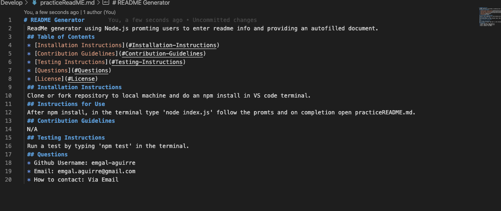

# README Generator 
 ReadMe generator using Node.js promting users to enter readme info and providing an autofilled document. 
 
 
 ## Table of Contents 
 * [Installation Instructions](#Installation-Instructions)  
 * [Questions](#Questions) 
 
 
 
 ## Installation Instructions 
 Clone or fork repository to local machine and do an npm install in VS code terminal. 
 Here is a link for a live demonstration: https://youtu.be/bgG_on309ow
 ## Instructions for Use 
 After npm install, in the terminal type 'node index.js' follow the promts and on completion open practiceREADME.md. 

 ## Questions  
 * Github Username: emgal-aguirre 
 * Email: emgal.aguirre@gmail.com 
 * How to contact: Via Email 

